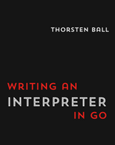

# My 'C-like' Interpreter

This project is based on the book [*Writing An Interpreter In Go*](https://interpreterbook.com/) by *Thorsten Ball*.

[](https://interpreterbook.com/)

Examples:

```
>>> int x = 10;
10
>>> float y = 3.50;
3.50000
>>> string s = "a string";
a string
>>> char c = 'c';
c
>>> x;
10
>>> 1 + 1;
2
>>> s;
a string
>>> int add(int a, int b) { return a + b; }
int add(int a, int b) { return a + b; }
>>> add(3, 5);
8
>>> int a[] = [1, 2, 3];
>>> a;
int[3] [1, 2, 3]
>>> int b[] = a + [4,5,6];
int[6] [1, 2, 3, 4, 5, 6]
>>> int c[] = b - a;
int[3] [4, 5, 6]
>>> c;
int[3] [4, 5, 6]
>>> dict f = {"one": 1, "two": 2};              
dict{"one": 1, "two": 2}
>>> f = f + {"three": f["one"] + f["two"]};
dict{"one": 1, "two": 2, "three": 3}
>>> f;
dict{"one": 1, "two": 2, "three": 3}
>>> dict g = f - {"two": 2};
dict{"one": 1, "three": 3}
>>> g;
dict{"one": 1, "three": 3}
>>> f = f + {"two": 2};       
dict{"two": 2, "three": 3, "one": 1}
>>> dict h = f + g;
dict{"one": 1, "two": 2, "three": 3}
>>> 
Ctrl + D to exit
```
